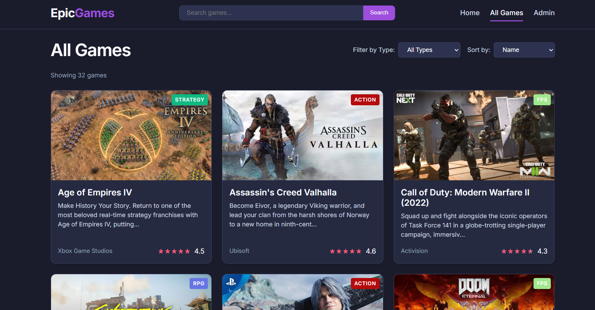

# 🎮 EpicGames Clone – Full Stack Project (Angular + Node.js + MongoDB)

A responsive web application that allows users to browse and filter a catalog of games.
## 🧰 Tech Stack

| Layer       | Technology                |
|-------------|---------------------------|
| Frontend    | Angular                   |
| Backend     | Node.js + Express         |
| Database    | MongoDB (Mongoose ODM)    |
| Styling     | Tailwind CSS              |

---

## 📸 Preview



---

## 🧑‍💻 Features

- Game listing with cards (title, image, rating, genre, description)
- Filter by game **type** (e.g., FPS, Action, RPG)
- Sort games by **name**, **rating**, or **release date**
- Search bar with real-time filtering
- Admin panel (optional)
- API integration with MongoDB backend
- Responsive layout

---

## 📂 Project Structure

```
/angular-node-gameApp/
├── game-api-backend/          # Node.js + Express API
│   └── models/                # Mongoose schemas
│   └── routes/                # Game API routes
│   └── server.js              # Entry point
├── games-front/               # Angular app
│   └── src/
│       └── app/
│           └── components/
│           └── services/
└── README.md
```

## 🚀 Getting Started

### 1. Clone the Repository

```bash
git clone https://github.com/your-username/epic-games-clone.git
cd epic-games-clone
```

### 2. Backend Setup

```bash
cd backend
npm install
```

### 3. Frontend Setup

```bash
cd frontend
npm install
ng serve
```

👉 Visit: http://localhost:4200

---

**NOTE:**

## 📦 Initial Game Data

The base data (video games) is located in this file:
➡️ `game-api-backend/data/gamesdb.games.json`

You can import it using MongoDB Compass or a Node.js script.
